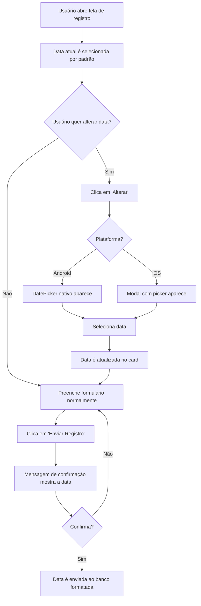

# 📅 Seleção de Data de Fechamento - Documentação

## Visão Geral

A funcionalidade de **Seleção de Data de Fechamento** permite que os frentistas escolham a data específica para registrar um fechamento de caixa, ao invés de usar sempre a data atual. Isso é especialmente útil para:

- Fechar dias anteriores que não foram registrados
- Corrigir fechamentos de datas passadas
- Registrar fechamentos retroativos

## 🎯 Funcionalidades

### 1. Card de Seleção de Data

Um card visual exibe a data atualmente selecionada para o fechamento:

```tsx
<View className="mx-4 mt-3 p-4 bg-white rounded-2xl border border-gray-100">
    <View className="flex-row items-center justify-between">
        <View className="flex-row items-center gap-3">
            <View className="w-10 h-10 bg-blue-100 rounded-full items-center justify-center">
                <Calendar size={20} color="#2563eb" />
            </View>
            <View>
                <Text className="text-xs text-gray-500 font-medium uppercase tracking-wider">
                    Data do Fechamento
                </Text>
                <Text className="text-base font-bold text-gray-800">
                    {formatDateDisplay(dataFechamento)}
                </Text>
            </View>
        </View>
        <TouchableOpacity onPress={() => { /* Abrir seletor */ }}>
            <Text className="text-white font-bold text-sm">Alterar</Text>
        </TouchableOpacity>
    </View>
</View>
```

**Localização**: Logo abaixo do card de seleção de frentista, antes do banner de teste.

### 2. Seletor de Data Nativo

#### Android
- Usa o DatePicker nativo do Android
- Aparece como um diálogo modal
- Fecha automaticamente após seleção

#### iOS
- Usa um Modal com DatePicker estilo "spinner"
- Mais integrado com o design do app
- Botão "Confirmar" para fechar

## 🔧 Implementação Técnica

### Estados

```typescript
// Data selecionada para o fechamento (padrão: data atual)
const [dataFechamento, setDataFechamento] = useState<Date>(new Date());

// Controla exibição do DatePicker no Android
const [showDatePicker, setShowDatePicker] = useState(false);

// Controla exibição do Modal no iOS
const [modalDataVisible, setModalDataVisible] = useState(false);
```

### Funções de Formatação

#### `formatDateDisplay(date: Date): string`
Formata a data para exibição no formato brasileiro.

**Entrada**: `Date` object  
**Saída**: String no formato `DD/MM/YYYY`

**Exemplo**:
```typescript
formatDateDisplay(new Date('2026-01-06'))
// Retorna: "06/01/2026"
```

**Implementação**:
```typescript
const formatDateDisplay = (date: Date): string => {
    const day = String(date.getDate()).padStart(2, '0');
    const month = String(date.getMonth() + 1).padStart(2, '0');
    const year = date.getFullYear();
    return `${day}/${month}/${year}`;
};
```

#### `formatDateForDB(date: Date): string`
Formata a data para envio ao banco de dados.

**Entrada**: `Date` object  
**Saída**: String no formato `YYYY-MM-DD` (ISO 8601)

**Exemplo**:
```typescript
formatDateForDB(new Date('2026-01-06'))
// Retorna: "2026-01-06"
```

**Implementação**:
```typescript
const formatDateForDB = (date: Date): string => {
    const year = date.getFullYear();
    const month = String(date.getMonth() + 1).padStart(2, '0');
    const day = String(date.getDate()).padStart(2, '0');
    return `${year}-${month}-${day}`;
};
```

### Handler de Mudança de Data

```typescript
/**
 * Handler para mudança de data no DatePicker
 * 
 * @param event - Evento do DatePicker
 * @param selectedDate - Data selecionada pelo usuário
 * 
 * Comportamento:
 * - iOS: Mantém o picker aberto para múltiplas seleções
 * - Android: Fecha automaticamente após seleção
 */
const handleDateChange = (event: any, selectedDate?: Date) => {
    setShowDatePicker(Platform.OS === 'ios'); // No iOS mantém aberto
    if (selectedDate) {
        setDataFechamento(selectedDate);
    }
};
```

## 📱 Componentes UI

### DatePicker para Android

```tsx
{showDatePicker && Platform.OS === 'android' && (
    <DateTimePicker
        value={dataFechamento}
        mode="date"
        display="default"
        onChange={handleDateChange}
        maximumDate={new Date()} // Não permite datas futuras
    />
)}
```

### Modal com DatePicker para iOS

```tsx
<Modal
    visible={modalDataVisible && Platform.OS === 'ios'}
    transparent={true}
    animationType="slide"
    onRequestClose={() => setModalDataVisible(false)}
>
    <View className="flex-1 bg-black/60 justify-end">
        {/* Overlay para fechar */}
        <TouchableOpacity
            className="absolute inset-0"
            onPress={() => setModalDataVisible(false)}
        />
        
        <View className="bg-white rounded-t-[32px] p-6 shadow-2xl">
            {/* Header */}
            <View className="flex-row justify-between items-center mb-4">
                <Text className="text-2xl font-black text-gray-800">
                    Selecionar Data
                </Text>
                <TouchableOpacity onPress={() => setModalDataVisible(false)}>
                    <X size={20} color="#6b7280" />
                </TouchableOpacity>
            </View>

            {/* DatePicker */}
            <DateTimePicker
                value={dataFechamento}
                mode="date"
                display="spinner"
                onChange={handleDateChange}
                maximumDate={new Date()}
                textColor="#000"
            />

            {/* Botão Confirmar */}
            <TouchableOpacity
                onPress={() => setModalDataVisible(false)}
                className="mt-4 bg-blue-600 py-4 rounded-2xl"
            >
                <Text className="text-white font-bold text-center text-lg">
                    Confirmar
                </Text>
            </TouchableOpacity>
        </View>
    </View>
</Modal>
```

## 🔄 Integração com Envio de Dados

### Mensagem de Confirmação

A data selecionada é exibida na mensagem de confirmação antes do envio:

```typescript
let mensagemConfirmacao = `Data: ${formatDateDisplay(dataFechamento)}\nEncerrante: ${formatCurrency(valorEncerrante)}\nTotal Pagamentos: ${formatCurrency(totalInformado)}`;
```

**Exemplo de mensagem**:
```
Data: 06/01/2026
Encerrante: R$ 1.500,00
Total Pagamentos: R$ 1.500,00

✅ Caixa bateu!
```

### Envio ao Banco de Dados

A data é formatada corretamente antes do envio:

```typescript
const closingData: SubmitClosingData = {
    data: formatDateForDB(dataFechamento), // "2026-01-06"
    turno_id: turnoId!,
    valor_cartao_debito: parseValue(registro.valorCartaoDebito),
    // ... outros campos
};
```

## ✅ Validações

### 1. Data Máxima
Não permite selecionar datas futuras:

```tsx
<DateTimePicker
    maximumDate={new Date()} // Data atual como máximo
    // ...
/>
```

**Comportamento**: Se o usuário tentar selecionar uma data futura, o picker não permitirá.

### 2. Data Padrão
Por padrão, a data atual é selecionada:

```typescript
const [dataFechamento, setDataFechamento] = useState<Date>(new Date());
```

## 📦 Dependências

### @react-native-community/datetimepicker

**Versão**: `^8.5.1`

**Instalação**:
```bash
npm install @react-native-community/datetimepicker
```

**Importação**:
```typescript
import DateTimePicker from '@react-native-community/datetimepicker';
```

**Documentação oficial**: https://github.com/react-native-datetimepicker/datetimepicker

## 🎨 Design e UX

### Cores e Estilo

- **Ícone**: Calendário azul (`#2563eb`)
- **Background do ícone**: Azul claro (`bg-blue-100`)
- **Botão "Alterar"**: Azul primário (`bg-blue-600`)
- **Texto da data**: Negrito, cinza escuro (`text-gray-800`)

### Hierarquia Visual

1. **Card de Frentista** (topo)
2. **Card de Data** (logo abaixo) ← Nova funcionalidade
3. **Banner de Teste** (temporário)
4. **Seção de Encerrante**
5. **Campos de Pagamento**

## 🐛 Troubleshooting

### Problema: DatePicker não aparece no Android

**Solução**: Verificar se o estado `showDatePicker` está sendo atualizado:
```typescript
setShowDatePicker(true); // Deve abrir o picker
```

### Problema: Modal não fecha no iOS

**Solução**: Verificar se o `onRequestClose` está configurado:
```typescript
<Modal
    onRequestClose={() => setModalDataVisible(false)}
    // ...
/>
```

### Problema: Data não está sendo enviada corretamente

**Solução**: Verificar se está usando `formatDateForDB()`:
```typescript
// ❌ Errado
data: dataFechamento.toISOString()

// ✅ Correto
data: formatDateForDB(dataFechamento)
```

## 📊 Fluxo de Uso



## 🔐 Segurança

- **Validação de data máxima**: Impede registros de datas futuras
- **Formatação consistente**: Garante que a data seja sempre enviada no formato correto (YYYY-MM-DD)
- **Validação no backend**: O backend deve validar novamente a data recebida

## 📝 Notas de Versão

**Versão**: 1.6.0  
**Data de Lançamento**: 06/01/2026

**Mudanças**:
- ✨ Adicionada funcionalidade de seleção de data de fechamento
- 📦 Adicionada dependência `@react-native-community/datetimepicker@^8.5.1`
- 🎨 Card visual para exibição da data selecionada
- 📱 Suporte para Android e iOS com componentes nativos
- ✅ Validação para impedir seleção de datas futuras

**Commits relacionados**:
- `feat: adicionar seleção de data de fechamento no app mobile` (0eaee87)
- `chore: atualizar versão para 1.6.0` (1d5fdea)
- `docs: atualizar CHANGELOG para versão 1.6.0` (3097c71)

## 🚀 Próximas Melhorias

- [ ] Adicionar seleção de intervalo de datas
- [ ] Mostrar histórico de fechamentos por data
- [ ] Adicionar atalhos para "Ontem", "Anteontem", etc.
- [ ] Permitir edição de fechamentos de datas anteriores
- [ ] Adicionar validação de fechamentos duplicados na mesma data

---

**Documentação criada em**: 06/01/2026  
**Última atualização**: 06/01/2026  
**Autor**: Thyago (com assistência de IA)
